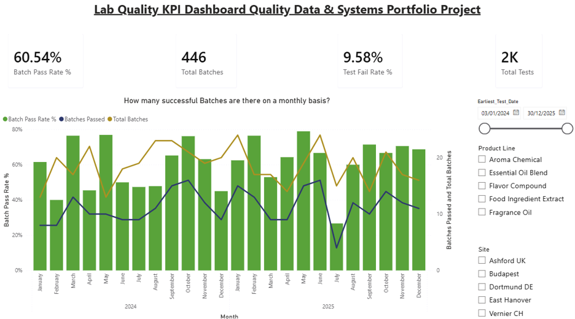
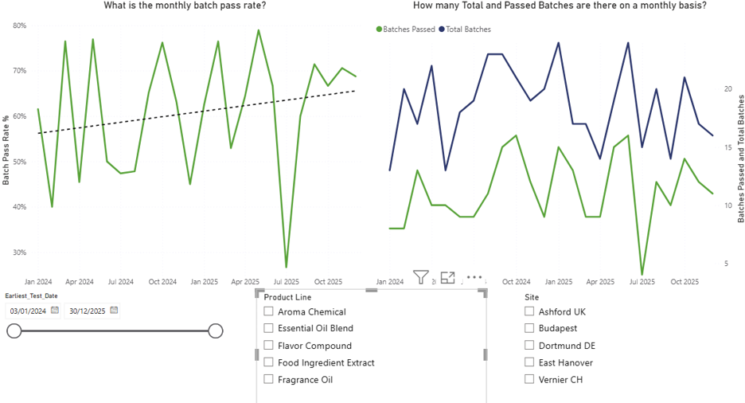
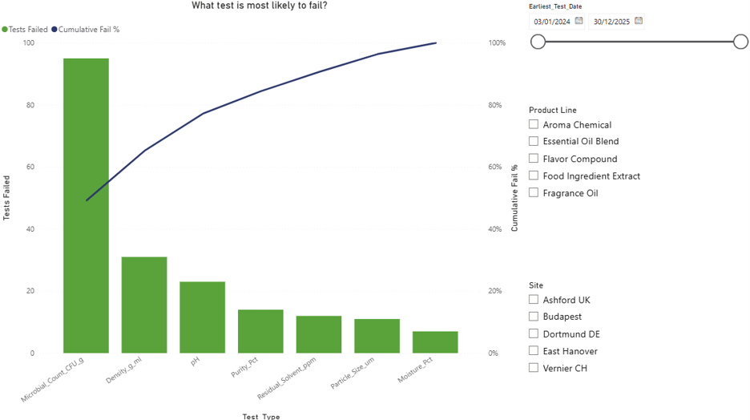

# Lab Quality KPI Dashboard

*A portfolio project demonstrating data cleaning, quality-data structuring, and BI dashboarding skills relevant to lab quality management systems.*

---

## 1. Overview & Motivation

This project simulates an end-to-end quality data workflow: raw lab test results are cleaned and structured in Excel, rolled up into batch-level release decisions, and visualized in an interactive Power BI dashboard.

It was built to demonstrate the specific skill set required for a **Quality Data and Systems** role: supporting a connected, digital quality ecosystem for global laboratory operations, including data integrity, traceability, and dashboarding for real-time insight into lab performance.

While enterprise platforms (SAP QM, LIMS) aren't accessible outside a corporate environment, this project reproduces the same underlying data problem those systems solve structuring raw test results into reliable, auditable quality decisions using accessible tools (Excel, Power Query, Power BI).

## 2. Data Source

**This dataset is synthetic.** It does not contain, represent, or derive from any real company's data. It was generated to structurally resemble a typical LIMS export[^1] in a process-manufacturing / fragrance & flavor quality lab context: one row per sample test, grouped into batches, each test checked against a specification range.

Field structure and parameter types (purity, moisture content, pH, density, microbial count, residual solvent, particle size) were grounded against a peer-reviewed, publicly available industrial pharmaceutical manufacturing quality dataset, to keep the simulated data structurally realistic rather than arbitrary.

The raw export was deliberately generated with realistic messiness — inconsistent site-name spelling, mixed date formats, missing results, and duplicate rows to give the cleaning stage genuine work to do, rather than starting from an already-tidy table.

## 3. Methodology

### 3.1 Data Cleaning (Excel)

1. Standardized inconsistent site-name entries into canonical values
2. Standardized mixed date formats
3. Identified and removed exact duplicate rows
4. Created a result pass marker using the result value and lower/upper spec limits
5. Flagged missing result values explicitly, rather than treating them as pass or fail by default
6. Applied pass / fail logic per test result against its specification range (`IF` / `AND` formulas)

### 3.2 Batch-Level Roll-Up Logic

A batch is only as good as its worst test result — this mirrors how an inspection lot is evaluated before release in a real quality system. The roll-up logic applied was:

- **Fail** — if any test within the batch failed
- **Pending** — if no test failed, but at least one result is missing
- **Pass** — only if every test in the batch both exists and passed

This was implemented two ways for cross-validation: as an Excel formula (`COUNTIFS`-based, evaluated per row) and as a Power Query grouped aggregation feeding the Power BI model directly. Both were checked against manually verified example batches before being trusted at scale.

### 3.3 Dashboard Structure (Power BI)

The report is organized across pages:

- **Overview**: KPI cards (Total Batches, Batch Pass Rate %, Total Tests, Test Fail Rate %) and a combined monthly view of pass rate against batch volume, to avoid a normalized rate hiding underlying volume changes.
- **Site & Product Breakdown**: pass rate compared across lab sites and product lines.
- **Failure Analysis**: a Pareto chart ranking which test parameter drives the most failures, with a cumulative-percentage line.

Site, Product Line, and date-range slicers are present on each page and synced, so a selection made on one page carries across the report.

## 4. Dashboard Screenshots

## 5. Relevance to SAP QM & LIMS Workflows

This project does not use SAP QM or a commercial LIMS platform — both are licensed enterprise systems not accessible outside a corporate environment. It does, however, model the same underlying data pattern those systems are built around:

- **LIMS** generates raw, sample-level test results as they come off lab instruments represented here by the raw synthetic export.
- **SAP QM** consumes structured quality data to make batch/inspection-lot release decisions represented here by the batch-level pass / fail / pending roll-up.
- **Dashboards / BI tools** sit on top of both, giving quality teams visibility into trends and failure drivers represented here by the Power BI report.

The goal of this project was to demonstrate fluency with that data flow and the analytical thinking it requires, using tools available outside a corporate license — not to claim direct SAP QM or LIMS platform experience.

## 6. Key Findings (Summary)

See [`Findings_Memo_Lab_Quality_KPI.pdf`](Findings_Memo_Lab_Quality_KPI.pdf) for the full business-facing write-up. Headlines:

- Overall batch pass rate: **60.5%** across 446 batches (~2,000 individual tests), 9.6% test-level fail rate
- **Microbial_Count_CFU_g** drives ~49% of all test failures — by far the single largest contributor
- **Vernier CH** underperforms the network average (53.6% vs. 60.5% pass rate), with a low point of 16.7% in April 2024
- **Fragrance Oil** shows a disproportionate concentration of failures on `Density_g_ml`, suggesting a formulation- or process-specific issue

## 7. Repository Contents

| File | Description |
|---|---|
| `lab_qc_raw_export.xlsx` | Raw synthetic LIMS-style export |
| `lab_qc_worked.xlsx` | Cleaned data, pass/fail logic, and validation pivot tables |
| `Lab_Quality_KPI.pbix` | Power BI report file |
| `Findings_Memo_Lab_Quality_KPI.pdf` | Business-facing summary of findings |
| `README.md` | This document |

## References

[^1]: [Nature Scientific Data — pharmaceutical manufacturing quality dataset](https://www.nature.com/articles/s41597-022-01203-x)
---

**Author:** David Mullor Tomas — [mullortomasd@gmail.com](mailto:mullortomasd@gmail.com)
